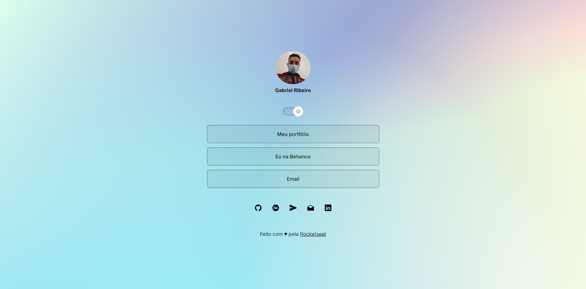

# Visit Card

Cartão de visitas copiado do [repositório do Samuel](https://github.com/samuelsoaresl/DevLinks), estilizado e adicionado recursos. O projeto publicado pode ser [acessado por aqui](https://gabriersdev.github.io/visit-card/)

## Funções

- Troca de tema
- Registro de tema salvo no navegador

## Tecnologias utilizadas

- HTML
- CSS
- JS
- Git e GitHub
- Figma
- jQuery
- Bootstrap
- Ionicons
